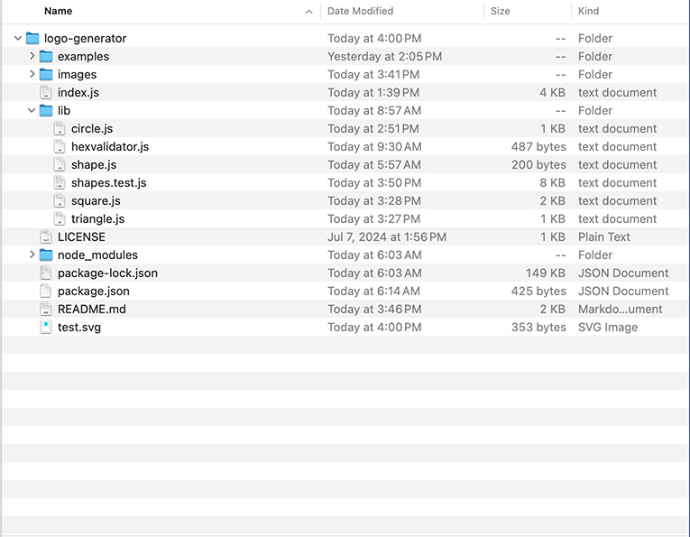
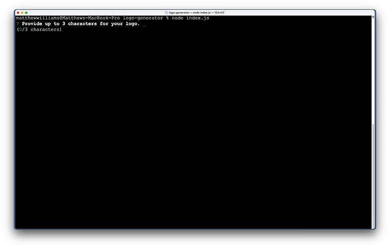

# Logo Generator

## License

MIT License

## Description
This app generates simple logos after gathering input from the user.

## Table of Contents
- [Installation](#installation)
- [Usage](#usage)
- [License](#license)
- [Contributing](#contributing)
- [Tests](#tests)
- [Questions](#questions)

## Installation
As a CLI, Logo Generator requires no installation, per se, but ensure that index.js and its associated files and folders are contained in the same folder as shown here. Logo Generator depends on the inquire (version 8.2.4) and inquire-maxlength-input-prompt modules available from NPM.

## Usage
To use Logo Generator, type "node index.js" in Terminal from the folder containing the index.js file. Complete the prompts to generate a logo file. Note that you can either choose from named color or provide your own hexidecimal color to the logo's icon and text. Hex colors should be keyed in RRGGBB format. To see a video of the application in action, click on the screen capture below.

## Contributing
To contribute to Logo Generator, clone this repository locally and commit your code to a separate branch.

## Tests
If you are making core library changes, please write unit tests for your code and ensure that everything is working correctly before opening a pull request.

## Questions
You can see my github repositories at [MatthewWilliamsCMH](https://github.com/MatthewWilliamsCMH/).  
Drop me a line at [matthewwilliamscmh@icloud.com](mailto:matthewwilliamscmh@icloud.com).